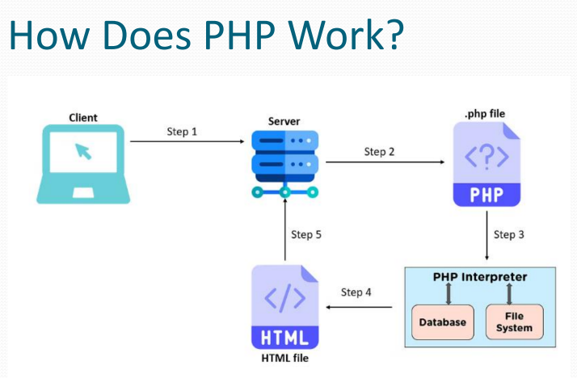

## PHP

Hypertext Preprocessor is an open-source server side scripting language used to develop web applications.

PHP is a widely-used, open source scripting language

PHP scripts are executed on the server

#### Why use a Server-Side Language?

1. Security > where the code cannot be seen by the client.
2. More efficient > where the browser does not have to do any work.
3. Database Access 
4. File System Access
5. Authentication
6. Sessions

#### Why PHP?
-runs on various platforms
-compatible with almost all servers used today (Apache, IIS, etc.)
-lots of freedom & flexibility
-supports a wide range of databases
-PHP is easy to learn and runs efficiently on the server side

#### What Can PHP Do?
-can generate dynamic page content
-can create, open, read, write, delete, and close files on the server
-can collect form data
-can send and receive cookies
-can add, delete, modify data in your database
-can be used to control user-access
-can encrypt data

---------

## SETUP ENVIROMNET FOR PHP

https://laragon.org/

https://www.apachefriends.org/

http://code.visualstudio.com/